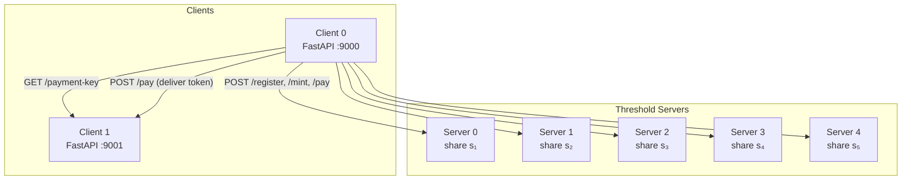

# System Architecture

## High-Level View

The system is a replicated payment service where **n threshold servers** jointly sign tokens using BLS blind signatures, and **clients** interact with those servers over HTTP to mint and transfer value.

## Components

### Server (`payment.server`)

Each server is a **FastAPI** application that holds:

| State | Purpose |
|-------|---------|
| `key_share` (`KeyShare`) | Its Shamir share `sᵢ = g(i)` of the system secret key |
| `system_public_key` (`G1_Point`) | The shared public key `PK = g(0)·G₁` |
| `clients` (`dict[str, ClientEntry]`) | Registered clients with balances and public-key nullifiers |
| `token_nullifiers` (`set[Token]`) | Set of spent tokens (prevents double-spending) |

**Endpoints:**

| Endpoint | Method | Purpose |
|----------|--------|---------|
| `/register` | POST | Register a client (id + long-term public key) |
| `/unregister` | POST | Remove a client |
| `/mint` | POST | Validate a mint request, return a partial blind signature |
| `/pay` | POST | Validate a pay transaction, return a partial blind signature for the recipient's new token |

### Client (`payment.client`)

Each client is both an **HTTP client** (to talk to servers and recipients) and a **FastAPI server** (to receive payments).

| State | Purpose |
|-------|---------|
| `public_key` / `private_key` | Long-term BLS key pair for authentication |
| `tokens` (`list[ClientToken]`) | Wallet of unspent tokens, each with its one-time secret key |
| `pending_keys` (`dict`) | One-time keys awaiting incoming payments |
| `balance` | Un-minted balance (decremented on each mint) |

**Client-side endpoints (FastAPI):**

| Endpoint | Method | Purpose |
|----------|--------|---------|
| `/payment-key` | GET | Generate and return a blinded one-time key for receiving a payment |
| `/pay` | POST | Accept an incoming payment (unblind + verify + store token) |
| `/demo/mint` | POST | _(demo only)_ Trigger a mint from outside |
| `/demo/pay` | POST | _(demo only)_ Trigger a pay from outside |
| `/demo/balance` | GET | _(demo only)_ Query balance and token count |

### Crypto Layer (`payment.crypto`)

Pure functions with no network I/O. Responsible for:

- Shamir secret sharing (polynomial generation, evaluation, Lagrange interpolation)
- BLS key pair generation
- Blind message creation and unblinding
- Partial signing and signature combination
- Signature verification via pairings

### CLI (`payment.cli`)

A **Typer** CLI that provides three commands:

| Command | What it does |
|---------|-------------|
| `payment setup` | Generate key shares and the system public key, save to `config/` |
| `payment server` | Start a server process with a given share file |
| `payment client` | Start a client process |

## Configuration

Two YAML files control the system:

- **`config/config.yaml`** — local development
- **`config/config.docker.yaml`** — Docker Compose

Both share the same schema defined by `Config` in `payment.models`.

| Field | Meaning |
|-------|---------|
| `system.servers` | Total number of servers (`n`) |
| `system.failures` | Tolerated omission failures (`f`), threshold = `f + 1` |
| `system.clients` | Expected number of clients |
| `system.initial_balance` | Starting un-minted balance per client |
| `system.delta` | Assumed network delay bound (seconds) |
| `system.public_key_path` | Path to the system public key file |
| `servers[i].id` | Server identifier |
| `servers[i].address` | Full HTTP address of the server |
