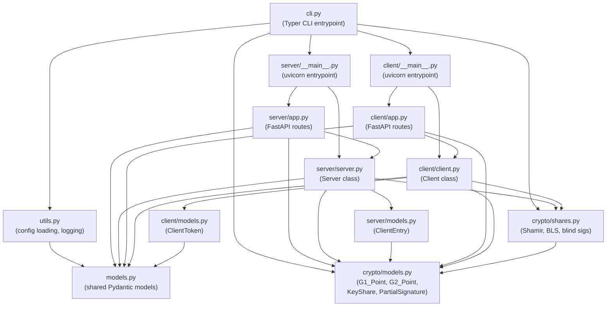

# Code Guide

This page provides a recommended reading order for understanding the codebase, along with a module-level dependency map.

## Module Dependency Graph

## Recommended Reading Order

### Phase 1: Data Models

Start with the data structures to understand what flows through the system.

1. **`payment/crypto/models.py`** — `G1_Point`, `G2_Point`, `FQ2_Point`, `KeyShare`, `PartialSignature`.  These are the serializable representations of elliptic-curve points and secret shares.

2. **`payment/models.py`** — `TokenPayload`, `MintRequest`, `SignedMintRequest`, `Token`, `Transaction`, `SignedTransaction`, `Payment`, `RegistrationRequest`, `Config`.  These define every message exchanged between clients and servers.

3. **`payment/client/models.py`** — `ClientToken` (a token bundled with its one-time secret key).

4. **`payment/server/models.py`** — `ClientEntry` (balance + public-key nullifier set tracked per client).

### Phase 2: Cryptography

Understand the math before reading protocol logic.

5. **`payment/crypto/shares.py`** — Read in this order:
    - `generate_polynomial` / `evaluate_polynomial` — Polynomial operations over `Z_q`.
    - `lagrange_coefficient` / `reconstruct_secret` — Shamir reconstruction.
    - `generate_shares` — Key generation (polynomial → shares → public key).
    - `create_fresh_key_pair` / `sign_message` / `verify_signature` — Standard BLS.
    - `blind_message` / `unblind_signature` — The blind signature primitive.
    - `partial_sign_blinded_message` / `combine_partial_signatures` — Threshold signing.

### Phase 3: Server

6. **`payment/server/server.py`** — The `Server` class.  Read `handle_register`, then `handle_mint`, then `handle_pay`.  Each handler validates inputs and returns a partial signature.

7. **`payment/server/app.py`** — Thin FastAPI wrapper (4 routes → 4 handler methods).

### Phase 4: Client

8. **`payment/client/client.py`** — The `Client` class.  Key methods:
    - `_broadcast` — Quorum-based request fan-out.
    - `mint_request` → `_prepare_mint` → `_process_mint_responses` — Full mint flow.
    - `pay_request` → `_prepare_pay` → `_process_pay_responses` — Full pay flow.
    - `generate_payment_key` / `receive_payment` — Recipient side.

9. **`payment/client/app.py`** — Client-side FastAPI routes (`/payment-key`, `/pay`, demo endpoints).

### Phase 5: Entrypoints and Config

10. **`payment/cli.py`** — Typer CLI: `setup`, `server`, `client` commands.
11. **`payment/utils.py`** — YAML config loading and logging setup.
12. **`config/config.yaml`** — System parameters.

### Phase 6: Tests

13. **`tests/test_shares.py`** — Verifies every crypto primitive in isolation.
14. **`tests/test_server.py`** — Server logic with mocked crypto.
15. **`tests/test_client.py`** — Client logic with mocked crypto + HTTP.
16. **`tests/test_integration.py`** — Full end-to-end with real crypto.

### Phase 7: Deployment

17. **`Dockerfile`** — Multi-stage build with `uv`.
18. **`docker-compose.yaml`** — 5 servers + 5 clients with shared config volume.
19. **`scripts/run_demo.sh`** / **`scripts/run_demo_docker.sh`** — Demo workflows.
