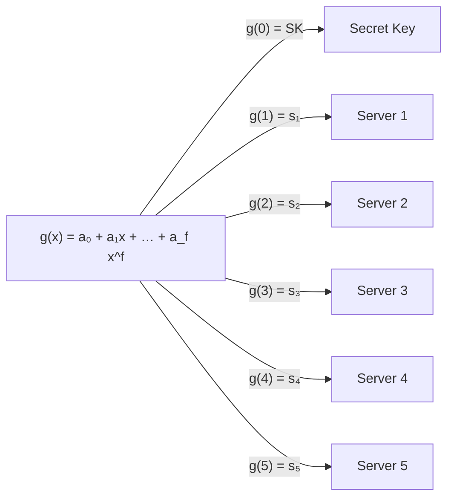
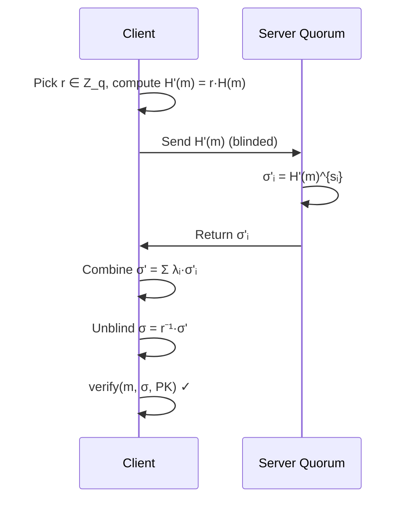

# Cryptographic Primitives

This page describes the cryptographic building blocks used by the payment scheme.  All elliptic-curve operations use the **BLS12-381** pairing-friendly curve via the [`py-ecc`](https://github.com/ethereum/py_ecc) library.

## BLS12-381 Curve

BLS12-381 is a pairing-friendly elliptic curve providing approximately 128 bits of security.  It defines two groups used by this system:

| Group | Generator | Used for |
|-------|-----------|----------|
| **G₁** | `G1` | Public keys |
| **G₂** | (via `hash_to_G2`) | Signatures and blinded messages |

A **bilinear pairing** `e : G₂ × G₁ → G_T` enables signature verification without knowing the secret key.

## Shamir Secret Sharing

The system secret key `SK = g(0)` is never held by any single party.  Instead, a random polynomial `g(x)` of degree `f` is created during setup, and each server `i` receives the share `sᵢ = g(i)`.

### Key functions

- **`generate_polynomial(degree)`** — Sample random coefficients `a₀, …, a_f ∈ Z_q`.
- **`evaluate_polynomial(coeffs, x)`** — Horner's method: `g(x) mod q`.
- **`lagrange_coefficient(i, points)`** — Compute `λᵢ = ∏_{j≠i} (−j)/(i−j) mod q` for interpolation at `x = 0`.
- **`reconstruct_secret(shares)`** — Recover `g(0) = Σᵢ sᵢ · λᵢ mod q` from any `f + 1` shares.
- **`generate_shares(n, f)`** — End-to-end: create polynomial, derive SK, PK, and `n` shares.

## BLS Signatures

A BLS signature on message `m` under secret key `SK` is:

$$
\sigma = H(m)^{SK} \in G_2
$$

where `H : {0,1}* → G₂` is the hash-to-curve function (`hash_to_G2` with the `G2Basic` DST).

**Verification** uses the bilinear pairing:

$$
e(\sigma, G_1) \stackrel{?}{=} e(H(m), PK)
$$

This holds because `PK = SK · G₁`, so both sides equal `e(H(m), G₁)^{SK}`.

### Key functions

- **`sign_message(message, private_key)`** — Compute `σ = H(m)^{sk}`.
- **`verify_signature(message, signature, public_key)`** — Check the pairing equation.
- **`create_fresh_key_pair()`** — Sample `sk ←$ Z_q`, return `(pk = sk·G₁, sk)`.

## Threshold Signing

No single server can produce a full signature.  Instead each server computes a **partial signature**:

$$
\sigma_i = H'(m)^{s_i}
$$

where `sᵢ` is the server's Shamir share.  Given any `f + 1` partial signatures, the client combines them using Lagrange interpolation in the exponent:

$$
\sigma = \prod_{i \in T} \sigma_i^{\lambda_i} = H'(m)^{\sum_i \lambda_i \cdot s_i} = H'(m)^{g(0)} = H'(m)^{SK}
$$

### Key functions

- **`partial_sign_blinded_message(blinded_msg, key_share)`** — Server-side: `σᵢ = blinded\_msg^{sᵢ}`.
- **`combine_partial_signatures(partials)`** — Client-side: `σ = Σᵢ λᵢ · σᵢ` (additive notation in `G₂`).

## Blind Signatures

Blind signatures are the cornerstone of **unlinkability**.  The client hides the actual message from the servers so they sign without seeing what they sign.

### Protocol

1. **Blind** — The client picks a random scalar `r ∈ Z_q` and computes `H'(m) = r · H(m)`.
2. **Sign** — Servers partially sign `H'(m)`, producing `σ'ᵢ = H'(m)^{sᵢ} = (r · H(m))^{sᵢ}`.
3. **Combine** — Client combines partials: `σ' = (r · H(m))^{SK}`.
4. **Unblind** — Client computes `σ = r⁻¹ · σ' = H(m)^{SK}`, a standard BLS signature.

### Key functions

- **`blind_message(message)`** — Returns `(r·H(m), r)`.
- **`unblind_signature(blinded_sig, r)`** — Computes `r⁻¹ · σ'` using Fermat's little theorem for modular inverse.

## Serialization

Elliptic-curve points are stored in **affine coordinates** using Pydantic models:

| Model | Fields | Group |
|-------|--------|-------|
| `G1_Point` | `x: int, y: int` | G₁ (public keys) |
| `G2_Point` | `x: FQ2_Point, y: FQ2_Point` | G₂ (signatures, blinded messages) |
| `FQ2_Point` | `c0: int, c1: int` | Extension field element |

Conversion between `py_ecc` projective coordinates and the affine Pydantic models is handled by `from_g1`/`to_g1` and `from_g2`/`to_g2` methods.
