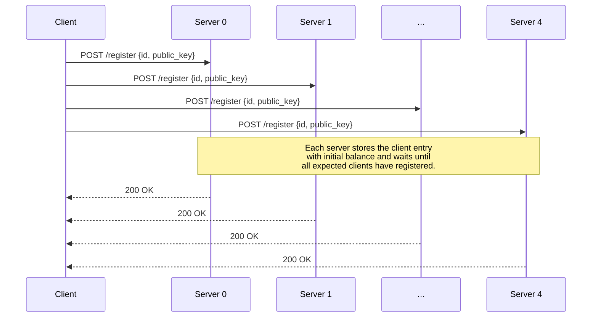
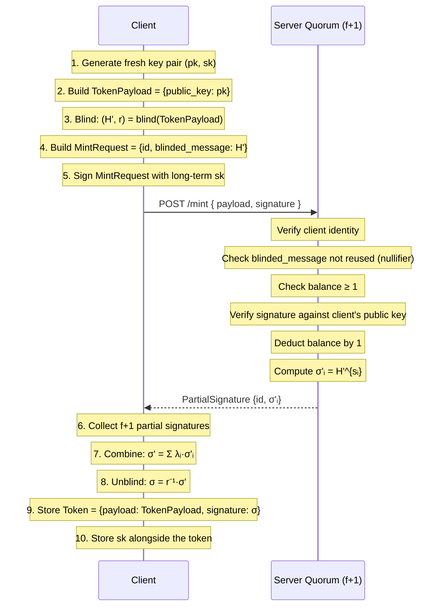
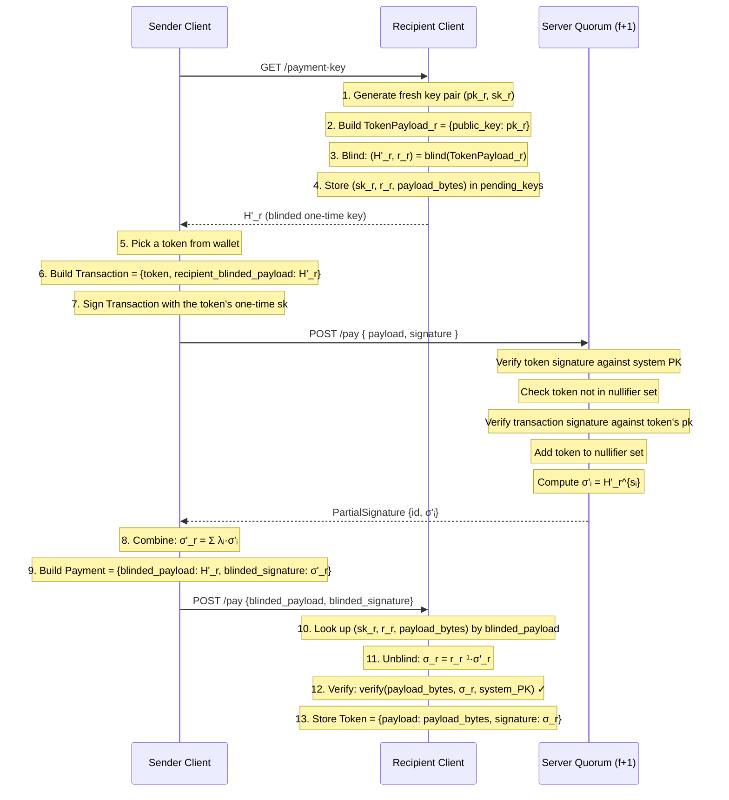
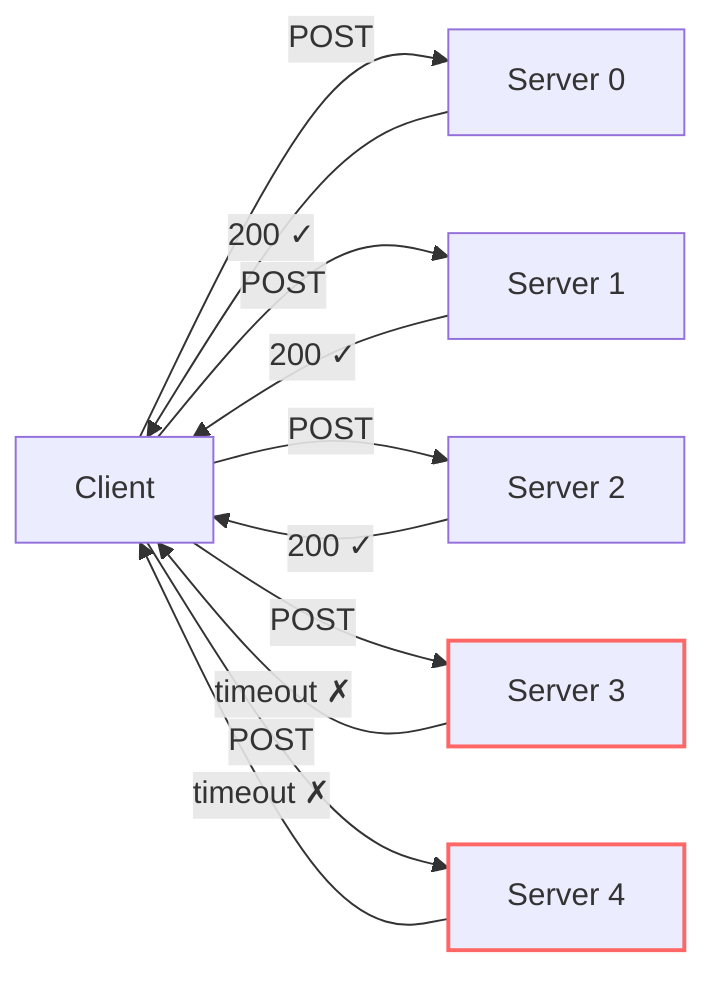

# Protocols

This page walks through each operation in the payment scheme step by step.

## Registration

Before any minting or paying, every client must register with all servers.

The server blocks the response until all `num_clients` have registered (using `asyncio.Event`), ensuring a synchronized start.
The client uses a timeout that equals `2 · Δ`, where `Δ` is the network synchronization delay.

## Mint

Minting creates a new token of value 1, consuming 1 unit of the client's un-minted balance.

### What the server sees vs. what the token contains

| Server sees | Token contains |
|---|---|
| Client identity (`id`) | Not stored — token is anonymous |
| `H' = r·H(TokenPayload)` (blinded) | `TokenPayload` (plaintext public key) |
| `σ'ᵢ` (partial blind signature) | `σ = H(TokenPayload)^{SK}` (unblinded full signature) |

Because `r` is secret and random, the server **cannot** derive `H(TokenPayload)` from `H'`, nor link `σ` back to `σ'ᵢ`.

## Pay

Payment transfers a token from one client (sender) to another (recipient).

### Value flow

- The sender's token is **consumed** (added to every server's nullifier set).
- The recipient receives a **fresh token** — independently signed, with a new one-time key pair.
- Total value is conserved: 1 token spent → 1 token created.

## Broadcast and Quorum

The client broadcasts every request to **all n servers** concurrently using `asyncio.gather`.  It collects responses and considers the operation successful once **f + 1** servers respond with HTTP 200.

If fewer than `f + 1` servers respond successfully, the client raises a `RuntimeError`.  This provides **liveness** as long as at most `f` servers suffer omission failures.

## Communication Protocol Summary

All communication uses **HTTP/JSON** over FastAPI:

| From | To | Transport | Serialization |
|------|----|-----------|---------------|
| Client → Server | `/register`, `/mint`, `/pay` | HTTP POST | Pydantic JSON |
| Server → Client | Response body | HTTP 200 | Pydantic JSON (`PartialSignature`) |
| Sender → Recipient | `/payment-key` (GET), `/pay` (POST) | HTTP | Pydantic JSON |
