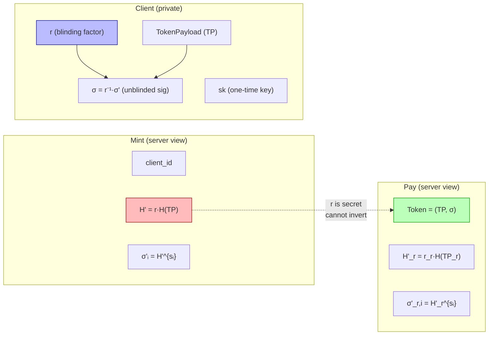

# Unlinkability & Threat Model

This page formalizes the threat model under which the payment scheme achieves **unlinkability**, describes the adversary's capabilities, and argues why Mint and Pay operations cannot be linked.

## Definitions

**Token.**  A token `T = (payload, σ)` where `payload` encodes a `TokenPayload` containing a fresh one-time public key, and `σ` is a BLS signature under the system public key `PK`.

**Link.**  A *link* is a mapping from a **Pay** transaction to the **Mint** operation that originally created the spent token.  Formally, given the transcript of a Pay operation (the `SignedTransaction` seen by the servers) and the set of all Mint transcripts, the adversary wins if it can identify which Mint produced the token being spent with probability significantly better than `1/N`, where `N` is the number of minted tokens.

## Adversary Model

We consider a **passive adversary** that can observe all server-side state and all network messages, but does not deviate from the protocol.

### What the adversary observes

| Observable | Content |
|---|---|
| **Mint requests** (all servers) | `SignedMintRequest` = `{ payload: MintRequest, signature }` where `MintRequest` contains `{ id, blinded_message: H' }` |
| **Pay requests** (all servers) | `SignedTransaction` = `{ payload: Transaction, signature }` where `Transaction` contains `{ token: Token, recipient_blinded_payload: H'_r }` |
| **Server state** | Client registry (id, balance, public-key nullifiers), token nullifier set |
| **Network metadata** | Timing and source IP of requests (not exploited in our model) |

### What the adversary does **not** observe

| Secret | Held by |
|---|---|
| Blinding factor `r` used during Mint | Minting client |
| One-time secret key `sk` of the token | Token holder |
| Blinding factor `r_r` used during Pay key generation | Recipient client |
| Plaintext `TokenPayload` before it is embedded in the final token | Client (sender or recipient) |
| Mapping between blinded and unblinded messages | Client |

The adversary may know:

- The total number of minted tokens and the number of payments.
- Client identities associated with Mint operations (since `MintRequest.id` is in the clear).
- The system public key `PK` and all server key shares `sᵢ`.
- The full protocol specification.

## Why Unlinkability Holds

### The core argument

During **Mint**, the server sees a blinded message:

$$
H' = r \cdot H(\text{TokenPayload})
$$

During **Pay**, the server sees the spent token:

$$
T = (\text{TokenPayload}, \sigma)
\quad\text{where}\quad
\sigma = H(\text{TokenPayload})^{SK}
$$

For the adversary to link Pay to Mint, it must determine which `H'` corresponds to which `TokenPayload`.  This requires inverting the blinding:

$$
H(\text{TokenPayload}) = r^{-1} \cdot H'
$$

Since `r` is a uniformly random scalar in `Z_q` known only to the client, and `H'` is a uniformly random element of `G₂` from the server's perspective, the distribution of `H'` is **independent** of the underlying `TokenPayload` given the adversary's view.

## Unlinkability Through the Protocol

The following diagram traces which values are visible at each stage and shows that no common identifier persists across Mint and Pay from the servers' perspective.

**Red** = blinded (server sees).  **Green** = unblinded (appears in Pay).  **Blue** = secret (never leaves client).

The server sees `H'` during Mint and `(TP, σ)` during Pay, but has no way to connect them without `r`.

## Additional Unlinkability Guarantees

### Fresh keys per token

Every Mint and every Pay recipient generates a **fresh one-time key pair**.  No key is ever reused, so public keys embedded in tokens cannot be correlated across operations.

### Blinded message nullifiers

Servers track blinded messages in per-client nullifier sets (`public_key_nullifiers`) to prevent a client from minting two tokens with the same blinded payload.  These nullifiers are **blinded values**, so they reveal nothing about the underlying token.

### No linkage via signatures

The final token signature `σ` is a standard BLS signature that any holder of `SK` could have produced.  It carries no information about which specific set of servers contributed partial signatures or what blinded form was used.

### Recipient blinding during Pay

During Pay, the **recipient** also blinds their new token's payload before it is sent to the servers.  This means the servers cannot link the new token issued during Pay to the recipient either, providing forward unlinkability in payment chains.

## Summary of Security Properties

| Property | Mechanism |
|----------|-----------|
| **Unforgeability** | BLS signatures under `PK`; only a quorum of servers can produce valid partials |
| **Authorization Unforgeability** | Mint/Pay requests are signed by the client's key; servers verify |
| **No Double Spend** | Token nullifier set — each token can be spent exactly once |
| **Liveness** | Broadcast to all, require only `f+1` responses; tolerates `f` omissions |
| **Conservation of Value** | Mint deducts balance; Pay atomically spends 1 and creates 1 |
| **Unlinkability** | Blind signatures hide token content from servers; fresh keys prevent cross-operation correlation |
